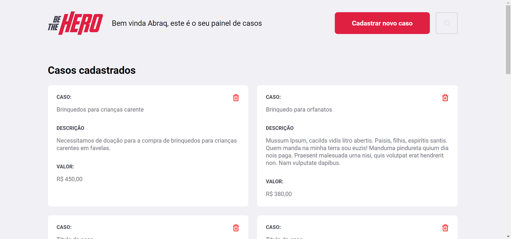
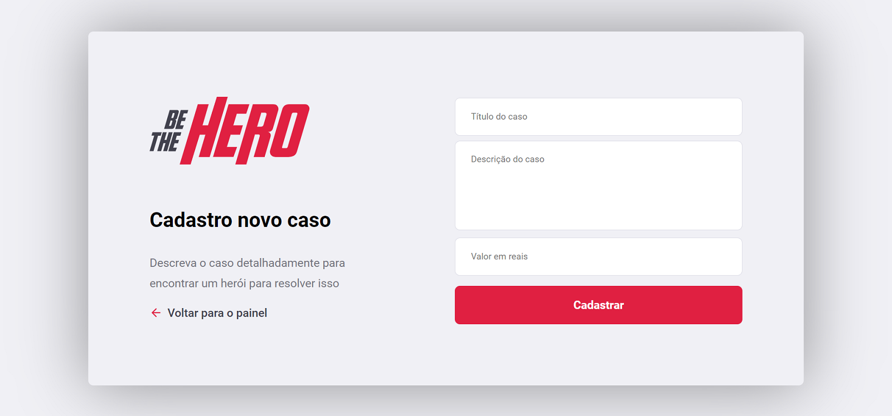
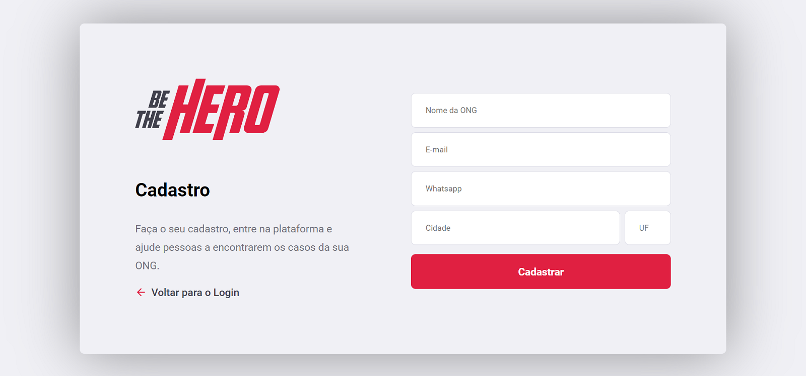
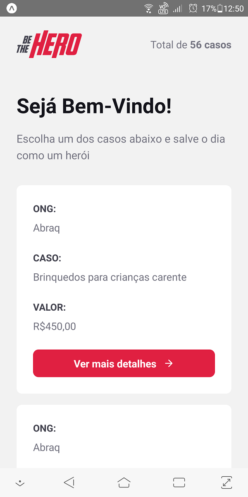
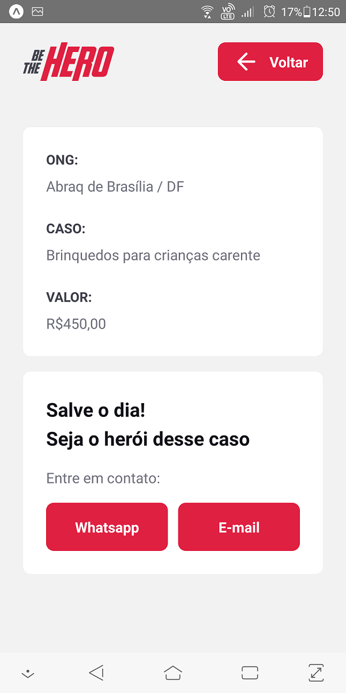

# Semana OmniStack 11.0
#### [RocketSeat.com.br](https://rocketseat.com.br/)

## :bulb: Objetivo do projeto 

O projeto Be The Hero irá conectar ONG's que necessitam de ajuda com pessoas que queiram ajudar.
Nele, ONG's iram cadastrar projetos e as pessoas interessadas poderam doar um valor qualquer para a causa.

#### Tecnologias utilizadas
- Node.js - Backend
- React - Frontend web
- React Native / Expo - Mobile
- SQLite - Banco de dados 

## :computer: Pagina Web

  
  
  
  

## :iphone: App Mobile

  
  

## Instalação 

Para executar esse repositório baixe-o para sua maquina ou de um `Git Clone`

### Backend 

- abra a pasta `OmniStack-11/aulas/backend/` na Shell (No windows Power Shell em modo administrador). 
- `$ npm install` esse comando ira instalar todos os módulos necessários ao Node.JS
-  `$ npm start` Ira iniciar o servidor backend na `localhost:3333\` 

### Frontend | Web

- abra a pasta `OmniStack-11/aulas/frontend/` na Shell (No windows Power Shell em modo administrador). 
- `$ npm install` esse comando ira instalar todos os módulos necessários ao React
-  `$ npm start` Ira iniciar o servidor Frontend na `localhost:3000\` 

### Mobile 

- abra a pasta `OmniStack-11/aulas/mobile/` na Shell (No windows Power Shell em modo administrador). 
- `$ npm install` esse comando ira instalar todos os módulos necessários ao React Native
-  `$ npm start` Ira iniciar o servidor  de desenvolvimento do Expo 

## :tv: Redes Sociais
 Abaixo algumas das minhas redes sociais:
 
    
  
   
  
   

  
